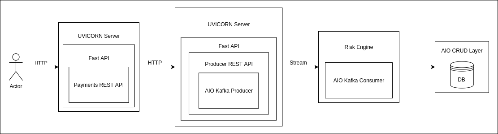
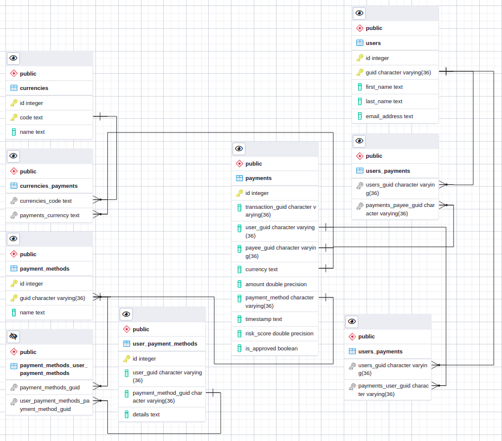

# Introduction
Implementation of peer-to-peer payment fraud detection system.
This implementation can be either used as a reference point or as a base for implementing a payment transaction 
interception system.


# Design


# API docs
API docs are available via `http://localhost:8000/api/v1/docs` once services are deployed


# Database Schemas


# Prerequisites
* Python >= 3.7
* Docker
* Docker Compose
* Kubernetes cluster / Minikube (optional) + kubectl

# Deployment
Deployment is supported in two forms:
1) Docker compose
2) Kubernetes cluster / Minikube

In order to deploy the project we will need:
1) Run `git clone https://github.com/Michaelliv/p2pay.git`
2) Run `cd p2pay`

## Docker Compose
1) Run `docker-compose up -d`
2) Run `docker-compose ps` to validate containers are running

## Kubernetes / Minikube
1) Run `kubectl apply -f templates/`
2) Run `kubectl get po` to validate pods are running

# Configuration
```
# Production env file, can be duplicated and changed to support local execution
# by replacing service hosts with 'localhost'.

PROJECT_NAME=p2pay
# Kafka
KAFKA_ZOOKEEPER_CONNECT=zookeeper:2181
KAFKA_ADVERTISED_HOST_NAME=kafka
KAFKA_ADVERTISED_PORT=9092
KAFKA_PORT=9092
KAFKA_CREATE_TOPICS="payments:1:1"
# Postgres
POSTGRES_PASSWORD=docker
POSTGRES_USER=docker
POSTGRES_DB=p2pay
POSTGRES_HOST=postgres
POSTGRES_PORT=5432
# Payments
PAYMENTS_HOST=payments
PAYMENTS_PORT=8000
# Producer
PRODUCER_HOST=producer
PRODUCER_PORT=9000
```

# Capacity Planning / Scalability

## Fast API Services
According to Techempower's [Benchmark](https://www.techempower.com/benchmarks/#section=data-r20&hw=ph&test=composite&f=zik0zj-zik0zj-zik0zj-zik0zj-zik0zj-zik0zj-zik0zj-ziimf3-zik0zj-zik0zj-zik0zj-cn3
). We can expect a maximum of 171k req/sec (or 542.27KB/s) for FastAPI. Given our average payload size is about 200b 
(rounded up), we can calculate:<br>
542Kb -> 542000b<br>
542000 / 200 = 2710 req/sec<br>

Which in all honesty - a shameful number, leading to two available options:
1) Switch to a more performant language/framework (go / FastHTTP)
2) Support auto-scaling for FastAPI-based services leveraging a load balancer and service replicas in Kubernetes 

## Kafka Cluster
### Topology
http://cloudurable.com/ppt/4-kafka-detailed-architecture.pdf

https://www.slideshare.net/ToddPalino/putting-kafka-into-overdrive

https://www.slideshare.net/JiangjieQin/no-data-loss-pipeline-with-apache-kafka-49753844

### Storage Space
| Retention Period | Compression Strategy | Average Message Size | Message Amount | Replication Factor | Minimal Required Disk Space      |
| ---------------- | -------------------- | -------------------- | -------------- | ------------------ | -------------------------------- |
| T                | c                    | x                    | y              | z                  | c * x * y * z over a period of T |
| 2 Weeks          | None                 | 200b                 | 14,000,000 (assuming 1 million transactions a day)    | 3 | 8.4Gb (rounded) |

Side note:
GUIDs should probably be converted to bigInt and stored as hex 

# Testing
## FastAPI
Testing FastAPI is fairly easy, examples can be found [here](https://fastapi.tiangolo.com/tutorial/testing/), FastAPI plays
very nice with `pytest`.

```python
from fastapi import FastAPI
from fastapi.testclient import TestClient

app = FastAPI()


@app.get("/")
async def read_main():
    return {"msg": "Hello World"}


client = TestClient(app)


def test_read_main():
    response = client.get("/")
    assert response.status_code == 200
    assert response.json() == {"msg": "Hello World"}
```

## Kafka Producers / Consumers
For unitests (where business logic interacts with Kafka), Kafka Producer and Consumers should be mocked.<br>
For system tests, a low capacity dedicated cluster would work fine.
For load testing [Ranger](https://blog.smartcat.io/2017/load-testing-kafka-with-ranger/) can be used.

## UI
For testing UI components [Puppeteer](https://developers.google.com/web/tools/puppeteer) can be used.

# Possible Enhancements
1) Replacing GUIDs with numeric ids
2) Use Logstash for faster debugging in production environment
3) Use secrets instead of passing passwords in environment variables