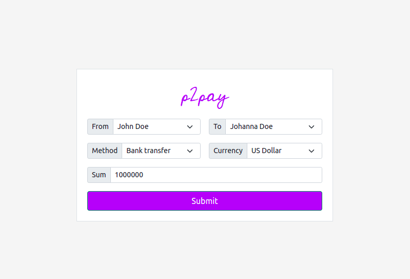
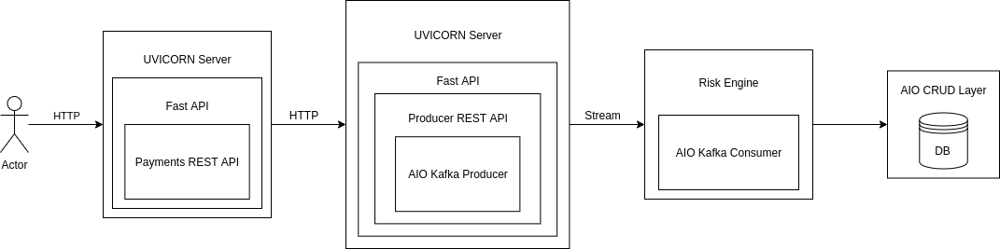
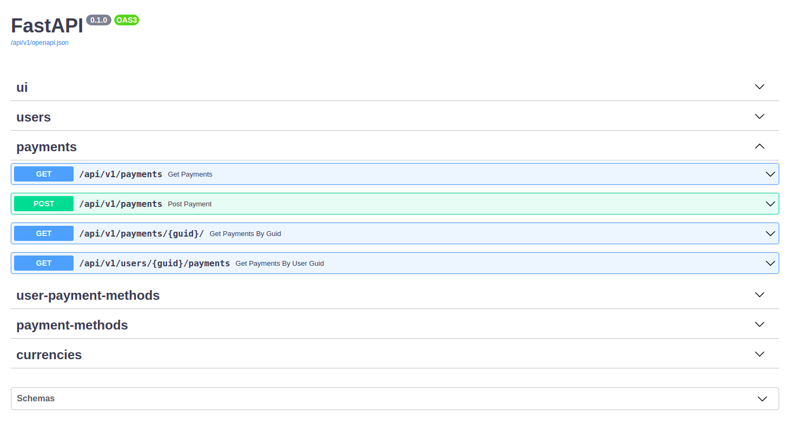

# Introduction
Implementation of peer-to-peer payment fraud detection system.
This implementation can be either used as a reference point or as a base for implementing a payment transaction 
interception system.




# Design


# API docs
API docs are available via `http://localhost:8000/api/v1/docs` once services are deployed


# Configuration
```
# Production env file, can be duplicated and changed to support local execution
# by replacing service hosts with 'localhost'.

PROJECT_NAME=p2pay
# Kafka
KAFKA_ZOOKEEPER_CONNECT=zookeeper:2181
KAFKA_ADVERTISED_HOST_NAME=kafka
KAFKA_ADVERTISED_PORT=9092
KAFKA_PORT=9092
KAFKA_CREATE_TOPICS="payments:1:1"
# Postgres
POSTGRES_PASSWORD=docker
POSTGRES_USER=docker
POSTGRES_DB=p2pay
POSTGRES_HOST=postgres
POSTGRES_PORT=5432
# Payments
PAYMENTS_HOST=payments
PAYMENTS_PORT=8000
# Producer
PRODUCER_HOST=producer
PRODUCER_PORT=9000
```

# Performance
Baseline performance will be determined by the "weakest link", here are some base numbers to consider:<br>

## Fast API
[Benchmark](https://www.techempower.com/benchmarks/#section=data-r20&hw=ph&test=composite&f=zik0zj-zik0zj-zik0zj-zik0zj-zik0zj-zik0zj-zik0zj-ziimf3-zik0zj-zik0zj-zik0zj-cn3
)<br>
171k req/sec for FastAPI or 542.27KB/s

## Kafka

## Postgres

# Prerequisites
* Python >= 3.7
* Docker
* Docker Compose
* Kubernetes cluster / Minikube (optional) + kubectl

# Deployment
Deployment is supported in two forms:
1) Docker compose
2) Kubernetes cluster / Minikube

In order to deploy the project we will need:
1) Run `git clone https://github.com/Michaelliv/p2pay.git`
2) Run `cd p2pay`

## Docker Compose
1) Run `docker-compose up -d`
2) Run `docker-compose ps` to validate containers are running

## Kubernetes / Minikube
1) Run `kubectl apply -f templates/`
2) Run `kubectl get po` to validate pods are running

# Debugging


# Scaling
## Fast API
## Kafka
## Risk Engine

# Testing
## Fast API
## Kafka
## SQLAlchemy
## UI
## Risk Engine

# Known Issues
Kafka issue
No CI/CD

# Possible Enhancements
## Replacing GUIDs with numeric ids
## Routing logs 
## Use secrets instead of passing passwords in environment variables